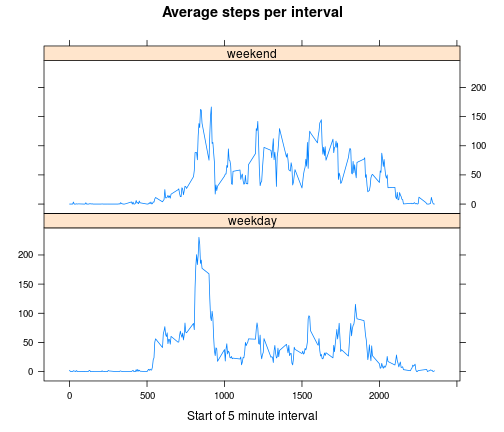

Project 1: Activity analysis
==============================
First we load the activity data from the file (which has to be in our directory):

```r
rawdata <- read.csv("activity.csv")
```
We calculate the total steps per day by applying *tapply* with the entries in the *date* column serving as factors; we ignore missing values and store our results in a vector *stepsperday*. Then, we determine mean and median values for total steps per day by using the respective functions on this vector.

```r
stepsperday<- tapply(as.numeric(rawdata$steps), rawdata$date, sum, na.rm=TRUE)
mean_spd <- mean(stepsperday)
median_spd <-median(stepsperday)
```
 We plot total steps per day as a histogram.

```r
hist(stepsperday, breaks = 10, main = "Total steps per day", xlab = "Total steps per day (uncorrected)")
```

 

Now we investigate the daily activity pattern by calculating the average number of steps per 5-minute interval. Again, we use *tapply*, this time using the entries in the *interval* column as factors. Since those entries are integers, we first have to use *as.factor()* on them. We store all average means in *mean_spi*.


```r
mean_spi <- tapply(as.numeric(rawdata$steps), as.factor(rawdata$interval), mean, na.rm=TRUE)
invstart <- sprintf("%04d", as.integer(names(mean_spi)))
invstart <- gsub('^([0-9]{2})([0-9]+)$', '\\1:\\2', invstart)
plot(names(mean_spi),mean_spi, type="l", main= "Average steps per interval", xlab="Start of 5 minute interval", ylab = "Average number of steps")
```

 

Finding the interval with the maximum number of average steps is easy, but we have to mess around to convert the integer value for the start of this interval to something that looks like a time. 

```r
maxinv <- mean_spi[mean_spi == max(mean_spi)]
maxstart <- sprintf("%04d", as.integer(names(maxinv)))
maxstart <- gsub('^([0-9]{2})([0-9]+)$', '\\1:\\2', maxstart)
```
 The interval of maximum average activity starts at 08:35.  
 
 In order to replace the NA of the missing values, we first have to determine how many of those there are:

```r
nacount <- sum(is.na(rawdata)==TRUE) 
```
 There are 2304 values missing, and they are all missing in column *steps*. We replace each NA value in *steps* by the integer value of the average for the respective time interval; we do this in a new data frame *newdata*. We retrieve the interval averages from the vector *mean_spi* we stored earlier; finally, we calculate the new mean and median. (This step might take a few seconds.)

```r
newdata <- rawdata
for (i in 1:length(newdata$steps)) {
    if (is.na(newdata$steps[i]) == TRUE) {
       newdata$steps[i] = as.integer(mean_spi[names(mean_spi) == as.character(newdata$interval[i])])
    } else {
        newdata$steps[i] = newdata$steps[i]
    }
}
spd_new <- tapply(as.numeric(newdata$steps), newdata$date, sum)
new_mean_spd <- mean(spd_new)
new_median_spd <-median(spd_new)
```
Another histogram, this time for the corrected total steps per day.

```r
hist(spd_new, breaks = 10, main = "Total steps per day, NAs replaced", xlab = "Total steps per day (NA replaced by integer of steps per respective period)")
```

 

We compare the new and old values for mean and median in a quick matrix:

```r
compare <- matrix(c(mean_spd, new_mean_spd, median_spd, new_median_spd), nrow=2, ncol=2) 
colnames(compare) <- c("mean", "median")
rownames(compare) <- c("ignoring NA", "replacing NA")
compare
```

```
##               mean median
## ignoring NA   9354  10395
## replacing NA 10750  10641
```
We now want to find out if a given day is weekday/weekend and append this new information as new column to the *newdata* data frame. We use the package *lubridate* to extract proper dates and *weekdays()* to extract the day of the week. We then check if a day is either a Saturday or Sunday; if so, it gets a logical true, otherwise a false. We substitute true/false by weekend/weekday and finally cbind the *day* vector to our data frame. We can now use this new *day* column as secondary factor when we investigate how the average steps per interval differ between weekdays and the weekend. As we apply two different factors in one go, we use the *aggregate()* function.

```r
library(lubridate)
day <- weekdays(ymd(newdata$date))
day <- day %in% c("Saturday", "Sunday")
day <- gsub("TRUE", "weekend", day)
day <- gsub("FALSE", "weekday", day)
day <- as.factor(day)
newdata <- cbind(newdata,day)
mean_spi_wd <- aggregate(as.numeric(newdata$steps), list(interval=as.factor(newdata$interval), day = newdata$day), mean)
colnames(mean_spi_wd)[3] <- "mean_spi"
```

We use a lattice plot to show data frame *mean_spi_wd* in two graphs, one for weekdays and one for the weekend. Then we display both; since the *interval* column consists of factors, we have to use *as.numeric()* on them in order to make the line plot work.

```r
library(lattice)
xyplot(mean_spi_wd$mean_spi~as.numeric(as.character(mean_spi_wd$interval))|mean_spi_wd$day, type="l", main="Average steps per interval", xlab="Start of 5 minute interval", ylab="",
   layout=c(1,2))
```

 
